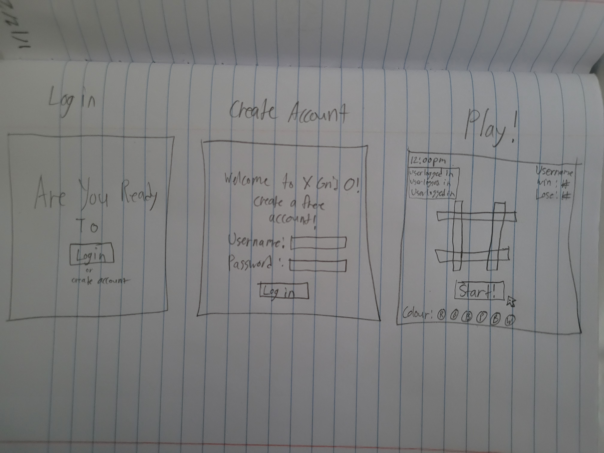

# startup specification
## Elevator Pitch
Aloha! Today I would like to introduce my startup website, X Grid O. Have you ever wanted to play tick tack toe but no one is available to play? Well X Grid O allows you to play tick tack toe against a program so you can hone your skills for the next time you see your friends. X Grid O is a free to play application but as it's poppularity grows, I plan to release a online multiplayer option which will cost $5 to have permanant access.

## Key Features
- Unique login name
- Colour changing 
- PvP(TBD)
- Game count(wins and loses)
- Player log in chat

## Technologies 
1. HTML
    - This will organize the look of the website for the login/create page as well as the main page where users will play the game.
2. CSS
    - This will animate the game itself with appearing symbols the user places as well as the colour they designate them to be.
3. JavaScript
    - This will allow users to click on the create tab to make their account for the first time. It will also allow them to log into an account they previously made.
4. Web service
    - This will call on another server to get the temperature
5. Authentication
    - This will allow users to create a unique log in with a username and password. No email required.
6. Database persistence
    - This will keep track of the users scores when they log into their account to play.
7. Websocket
    - This will be a real time log of users who are logging in to play.
8. Web framework
    - This will be the icing on the cake that makes the website user friendly as well as visually pleasing.

## Project Design

## HTML Deliverable
For this section of my startup I:
* Created 4 HTML pages. The main page is where you log in, the account page is where you can create an account, the play page is where xgrido can be played, and the scores page is where players can see their win/lose counts as well as how long they've been playing and the weather in their area.
* For each page I also created links where if a player clicks login or create account they will be directed to either the play or account pages. There is also links at the top for players to click on if they want to direct themselves that way.
* Each time a player logs in, wins, or loses, a text will notify all current players of their status.
* I have a place holder image that will later change based on the weather that is in the current area of the player
* The login information will be stored along with the players win/lose count so everytime they log in they can keep track.
* The websocket will be real time log in and win/lose notifications of other players.

## CSS Deliverable
For the CSS section of my startup I:
* Seperated the Header and Footer sections to take up a small part of the page with the main taking up majority of it
* With the help of bootstrap and some other CSS I was able to make the navigation bar elements to look like big buttons for users to press. I also changed the color to make them stand out from the blue header section.
* Overall the website works wih all sizes.
* Everything has been spaced out to not make the website looked cluttered.
* There are two fonts used, one for the main welcome page and the other is for the normal sub text.
* Image has been centered on the scores page to draw useres attention to the weather without needing to look at the text below.

## JS Deliverable
For the JS section of my startup I:
* Stored users information in a local database to keep track of their scores
* I updated the game log on the play page to update whenever a user wins or loses a game. That log will alos later call on websocket to update with other users wins
* The xgrido game is now fully playable against the computer.
* All data is stored even after player exits the website

## startup service
For the services on my startup I:
* called third party to grab the temperature of provo on my front end
* created a end point on my front and backend to retrieve and store scores of players
* opened the server to port 4000

## startup login
* I removed the temporary database from local storage and made a real one in mongodb to hold usernames, passwords, tokens, and scores
* I made endpoints to link the front and back end to ensure the database creates an account and updates the scores whenever someone loses or wins
* The login page sucessfully prevents users from logging in if their isn't an account in the system